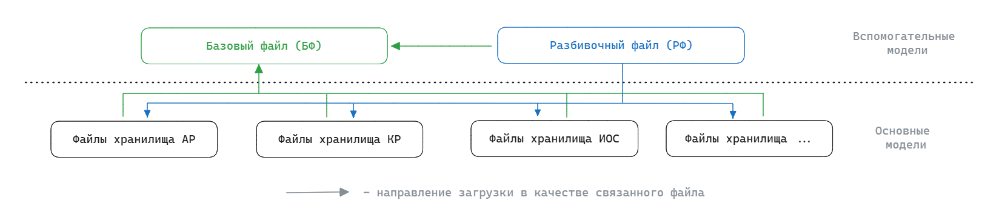
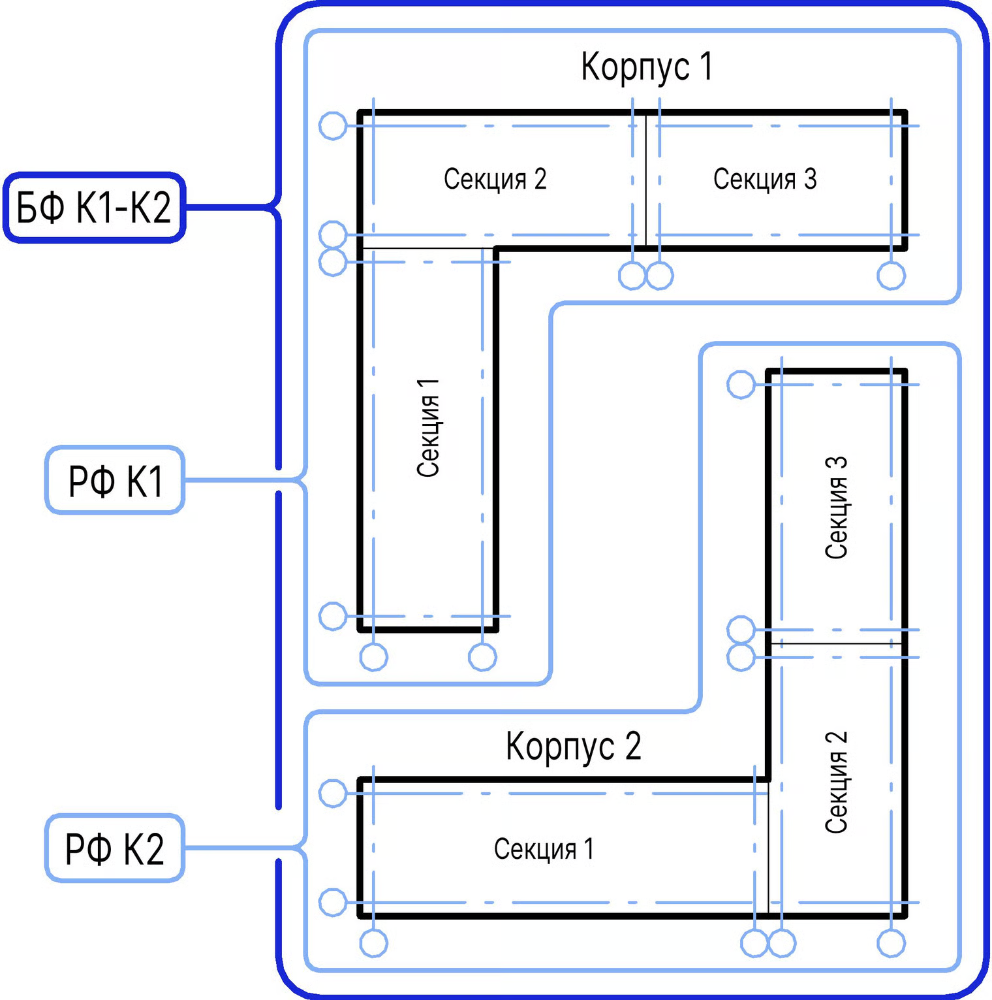
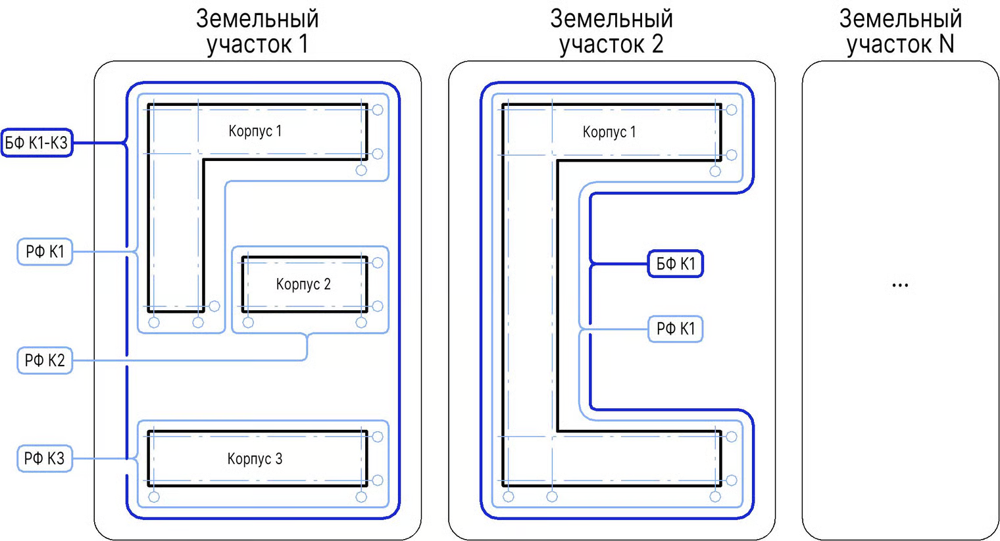

Разделение BIM-проекта на несколько информационных моделей обеспечивает основу для многопользовательского доступа к модели и осуществления эффективной коллективной работы. Разделение может быть обусловлено назначением моделей, требованиями заказчика, размерами моделируемого объекта, количеством зон застройки, земельных участков, корпусов, секций, разбивкой по комплектам, разрабатываемым разделом, комфортностью моделирования, совместной работой, и т.д.

## Типы информационных моделей

По отношению к разработке информационной модели для формирования комплектов документации можно выделить 2 типа моделей: основные и вспомогательные.

{width=1648px height=363px}

1. **Основные** – модели в которых ведется разработка проектных решений и формирование комплектов документации;

2. **Вспомогательные** – модели в которых не ведется разработка проектных решений, но которые необходимы для полноценной работы и координации основных моделей.

:::info 

Любой файл BIM-проекта создают только сотрудники BIM-отдела:

-  основные модели формируются по поручению ГИПа или менеджера проекта;

-  вспомогательные файлы создаются по необходимости самостоятельно.

:::

### Основные модели

Основные модели для разработки проектных решений делятся согласно следующим принципам:

-  ​информационная модель содержит данные только одной разрабатываемой дисциплины (исключением могут являться модели инженерного оборудования и сетей, где несколько инженерных разделов могут быть объединены в одну модель);

-  ​информационная модель содержит только одно здание;

-  ​большой размер объекта или информационной модели может потребовать дальнейшего разделения геометрии для сохранения работоспособности, учитывая мощности аппаратных средств проектирования;

-  ​разделение моделей может изменяться в зависимости от наполненности проектов на разных стадиях проектирования (эскизный проект, стадия проектной или рабочей документации).

В рамках каждой дисциплины могут существовать дополнительные принципы разделения моделей:



---

*  

   Дисциплина

*  

   Возможные критерии разделения

---

*  

   Архитектурные решения

*  

   -  ​относительно групп этажей: подземные, надземные, типовые

   -  ​относительно разрабатываемых разделов: фасады, архитектурные или интерьерные решения

---

*  

   Конструктивные решения

*  

   -  ​относительно деформационных швов и информационных блоков

   -  ​относительно типов разрабатываемых конструкций: железобетонные, металлические, деревянные

   -  ​относительно типов разрабатываемых конструкций: вертикальных или горизонтальных

---

*  

   Инженерное оборудование и сети

*  

   -  ​относительно разрабатываемой инженерной системы



:::info 

Разделение модели может быть обусловлено требованиями заказчика, планом реализации BIM-проекта ([п. 2.5 настоящего стандарта](./2-5-plan-informacionnogo-modelirovaniya)), комфортностью моделирования или с учетом принятых в компании процессов информационного моделирования.

:::

### Вспомогательные модели

**Базовый файл (БФ)** – это файл проекта, содержащий определение абсолютных и относительных координат проекта, а также направление истинного севера. Основная роль файла – пространственная координация всех разделов BIM-модели за счет общих для всех моделей координат ([п. 2.3 настоящего стандарта](./2-3-koordinaciya-modeley-proekta)), а также направление истинного севера и назначение площадки. Также данный файл может использоваться для координации работы, выполнения проверок и выполнения функции сводной модели.

**Разбивочный файл (РФ)** – это файл проекта, содержащий координационные оси и уровни. Используется для загрузки в качестве связанного файла во все файлы проектов с целью последующего создания осей и уровней средствами копирования и мониторинга ([п. 2.3 настоящего стандарта](./2-3-koordinaciya-modeley-proekta)). Данный файл позволяет централизованно управлять положением координационных осей и уровней во всех файлах проекта.

:::note 

Наполнение и редактирование осей и уровней разбивочного файла – зона ответственности проектировщиков раздела АР.

:::

Каждый BIM-проект, состоящий из нескольких моделей, содержит минимум один базовый файл, который формируется без разделения на корпуса и является для них единым. Для каждого корпуса создается свой разбивочный файл:

{width=1520px height=1531px}

В случае, когда проект содержит несколько земельных участков, то для каждого земельного участка создается отдельный базовый файл. Для каждого корпуса создается свой разбивочный файл:

{width=1520px height=823px}

При возникновении необходимости для проекта могут быть созданы и дополнительные файлы, например:

**Модель ген. плана** – это файл проекта, в который импортирована модель генерального плана проекта из Civil 3D (или аналога) для определения истинных координат и высотных отметок.

**Сводная модель** – это информационная модель, состоящая из соединенных между собой отдельных моделей по различным разделам проекта или в пределах одного раздела, при этом внесение изменений в одну из моделей не приводит к изменению в других. Функция данной модели заключается в соединении различных частей проекта воедино с целью пространственной координации, т.е. обнаружения и устранения коллизий.

**Файл заданий на отверстия** – это информационная модель, содержащая задания на отверстия для обмена между смежными дисциплинами.