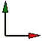
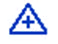
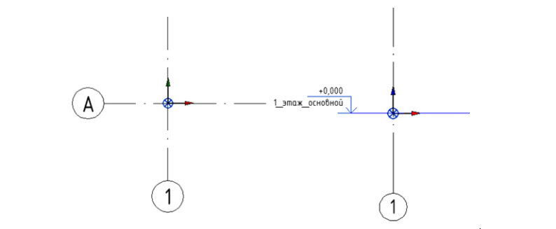
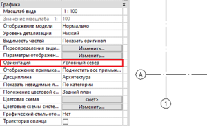
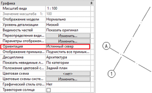

### Пространственная координация проекта

Пространственная координация выполняется для нахождения всех моделей проекта в системе общих координат. Для выполнения данной задачи используется **базовый файл проекта** (п. 2.2 настоящего стандарта). Настройка и проверка пространственной координации осуществляется BIM-отделом.

Все модели одного проекта находятся в общей системе координат. При загрузке связанных файлов Revit необходимо выбирать опцию "По общим координатам", т.к. в таком случае загруженные связанные файлы Revit находятся в тех же координатах, что и базовый файл проекта.

Для целей пространственной координации в каждом проекте существует несколько опорных точек:

**1\.Внутренне начало** – начальная точка внутренней системы координат Revit, которая является основой для размещения всех элементов в модели, т.е. это "программный ноль". {width=70px height=69px}

:::info 

Местоположение внутреннего начала фиксировано и никогда не перемещается.

:::

**​2.Точка съемки** отвечает за абсолютную систему координат. Определяет ориентацию геометрии здания в системе координат съемки, т.е. известная точка в реальном мире.{width=58px height=44px}

**3\.Базовая точка** отвечает за относительную систему координат. Определяет опорную точку для измерения расстояний и расположения объектов относительно модели, т.е. (0,0,0) системы координат проекта. {width=39px height=39px}

Базовая точка каждой модели должна располагаться во внутреннем начале проекта. Также в базовой точке располагается первое пересечение разбивочных осей как правило, пересечение осей 1/А и уровень с отметкой 0.000.

{width=794px height=327px}

Базовая точка должна содержать "**Угол от истинного севера"**, который позволяет управлять ориентацией модели, т.е. задавать истинный или условный север здания:

 



---

*  

   **Условный север** – ориентация модели для упрощения процесса проектирования и размещения на листах, при моделировании в свойствах вида для параметра "Ориентация*"* ставится "Условный север".

*  

   {width=300px height=183px}

---

*  

   **Истинный север** – это ориентация по направлению на север, определяемая фактическими условиями площадки.

*  

   {width=300px height=183px}



### Координация сетки осей и уровней

Для координации сетки осей и уровней используется **разбивочный файл проекта** (п. 2.2 настоящего стандарта). С его помощью между осями и уровнями каждой модели проекта и осями и уровнями разбивочного файла создается двухстороння связь, именуемая мониторингом, которая уведомляет пользователя в случае изменения их положения или наименования.

:::note 

Расположение и наименование осей и уровней каждой основной модели проекта должно строго соответствовать расположению и наименованию осей и уровней разбивочного файла!

:::