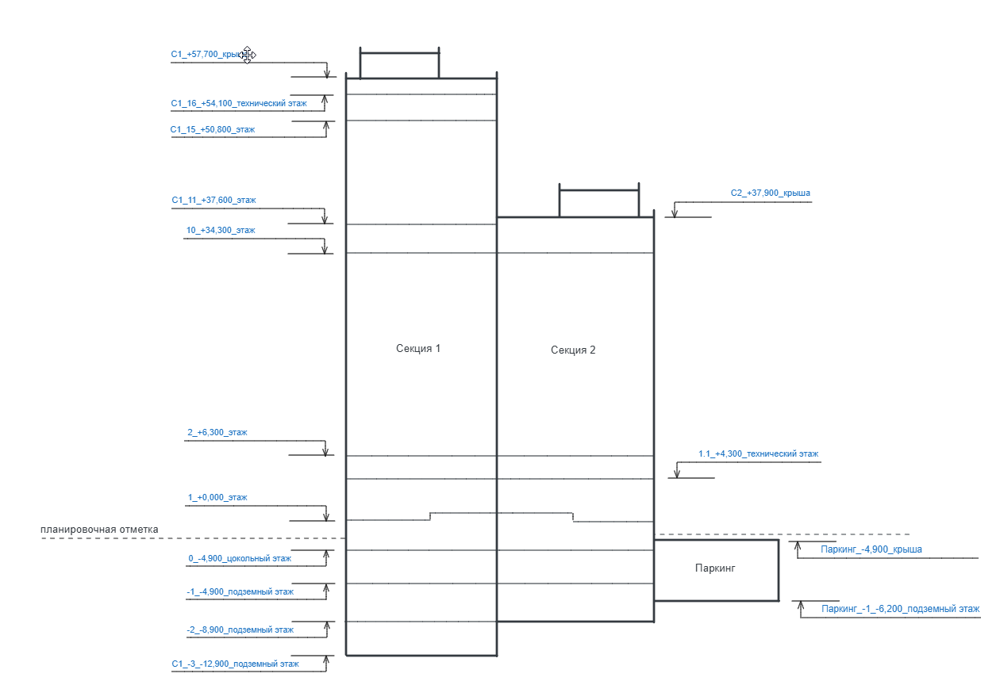

:::info 

Общие правила построения имен и требования отражены в п.4.5.1 настоящего стандарта.

:::

Наименование уровней модели должно соответствовать следующей схеме (опциональные поля помечены символом \*):

[highlight:light-pink]Секция или блок\*[/highlight]\_[highlight:light-pink]Номер уровня\*[/highlight]\_[highlight:lemon-yellow]Отметка[/highlight]\_[highlight:mint-green]Имя уровня[/highlight]

**Примеры:**

-  [highlight:light-pink]​С1-2[/highlight]\_[highlight:light-pink]12[/highlight]\_[highlight:lemon-yellow]\+10,050[/highlight]\_[highlight:mint-green]этаж[/highlight]

-  ​[highlight:light-pink]С2,4[/highlight]\_[highlight:light-pink]1\.1[/highlight]\_[highlight:lemon-yellow]\+4,500[/highlight]\_[highlight:mint-green]технический этаж[/highlight]

-  ​[highlight:light-pink]С1[/highlight]\_[highlight:light-pink]0[/highlight]\_[highlight:lemon-yellow]\-1,200[/highlight]\_[highlight:mint-green]цокольный этаж[/highlight]

-  ​[highlight:light-pink]Б3[/highlight]\_[highlight:light-pink]1[/highlight]\_[highlight:lemon-yellow]\+0,000[/highlight]\_[highlight:mint-green]этаж[/highlight]

-  ​[highlight:light-pink]\-1[/highlight]\_[highlight:lemon-yellow]\-3,500[/highlight]\_[highlight:mint-green]подземный этаж[/highlight]

-  [highlight:light-pink]​Паркинг[/highlight]\_[highlight:light-pink]\-1[/highlight]\_[highlight:lemon-yellow]\-6,200[/highlight]\_[highlight:mint-green]подземный этаж[/highlight]

-  [highlight:lemon-yellow]​+30,900[/highlight]\_[highlight:mint-green]крыша[/highlight]

-  [highlight:light-pink]​C3[/highlight]\_[highlight:lemon-yellow]\+33,900[/highlight]\_[highlight:mint-green]архитектурная высота[/highlight]

[highlight:light-pink]Секция или блок[/highlight] – опциональное поле, которое вводится для информационных моделей, в которых есть разделение здания/сооружения по корпусам, секциям, блокам и т.д.. Содержит символ "C"(секция) или "Б"(блок) на кириллице и номер секции/блока, или другое согласованное название сооружения, например, паркинг, школа и т.д..

:::info 

В случае если отдельностоящее здание/сооружение состоит их нескольких секций/блоков они указываются через дефис "–", например, С1–2, или через запятую ",", в случае номеров не по порядку, например, С1,3.

:::

[highlight:light-pink]Номер уровня[/highlight] – опциональное поле, которое вводится для обозначения номера уровня. Используется в **большинстве случаев**, кроме уровней с именами "крыша" или "архитектурная высота". Содержит цифровое обозначение уровня.

При выборе номера используются следующие правила:

-  ​нумерация уровней, относящихся к этажам здания, привязывается к нумерации этажей здания;

-  ​технические этажи, пространства и т.д. получают отдельный номер этажа только в случае влияния на этажность;

-  ​в случае если для осуществления информационного моделирования требуются дополнительные уровни в пределах одного этажа здания, для их номеров используется обозначение "х.х", показывающее номер нижележащего основного этажа и номер дополнительного уровня через точку, например, 1.1 - это номер дополнительного уровня 1 этажа;

-  ​нумерация надземных этажей начинается с 1 (нижнего надземного этажа здания);

-  ​для нумерации цокольного этажа используется номер 0;

-  ​номера подвальных и подземных этажей обозначаются отрицательными значениями со знаком "-";

-  ​уровень не указывается для уровней крыши и архитектурной высоты.

[highlight:lemon-yellow]Отметка[/highlight] – постоянное поле для обозначения высотной отметки уровня. Содержит цифровое обозначение отметки уровня в формате ±x,xxx (метры).

[highlight:mint-green]Имя уровня[/highlight] – постоянное поле для обозначения имени уровня. Содержит одно из нижеперечисленных значений на кириллице:



---

*  

   Имя уровня

*  

   Описание

---

*  

   [highlight:mint-green]подземный этаж[/highlight]

*  

   Этаж с помещениями, расположенными ниже планировочной отметки земли на всю высоту помещения.

---

*  

   [highlight:mint-green]подвал[/highlight]

*  

   Первый подземный этаж с отметкой пола помещений ниже планировочной отметки земли более чем на половину высоты помещений.

---

*  

   [highlight:mint-green]цокольный этаж[/highlight]

*  

   Этаж с отметкой пола ниже планировочной отметки земли с наружной стороны стены на высоту не более половины высоты помещений.

---

*  

   [highlight:mint-green]этаж[/highlight]

*  

   Этаж с отметкой пола помещений не ниже планировочной отметки земли считается надземным. При переменных планировочных отметках земли этаж считается надземным при условии, что более 60% общей площади помещений находится не ниже планировочной отметки уровня земли или необходимые по нормам эвакуационные выходы с этажа имеют непосредственный горизонтальный проход на отметку земли.

---

*  

   [highlight:mint-green]технический этаж[/highlight]

*  

   Этаж для размещения инженерного оборудования и прокладки коммуникаций. Пространство для прокладки коммуникаций высотой менее 1,8м этажом не является.

---

*  

   [highlight:mint-green]техническое подполье[/highlight]

*  

   Технический этаж между перекрытием первого или цокольного этажа и поверхностью грунта для размещения трубопроводов инженерных систем.

---

*  

   [highlight:mint-green]чердак[/highlight]

*  

   Пространство между перекрытием верхнего этажа, покрытием здания (крышей) и наружными стенами (при их наличии), расположенное выше перекрытия верхнего этажа.

---

*  

   [highlight:mint-green]мансардный этаж[/highlight]

*  

   Этаж в чердачном пространстве, фасад которого полностью или частично образован поверхностью (поверхностями) наклонной, ломаной или криволинейной крыши, при этом линия пересечения плоскости крыши и фасада должна быть на высоте не более 1,5 м от уровня пола мансардного этажа.

---

*  

   [highlight:mint-green]крыша[/highlight]

*  

   Внешняя несущая и ограждающая конструкция здания или сооружения для защиты помещений от внешних климатических и других воздействий.

---

*  

   [highlight:mint-green]архитектурная высота[/highlight]

*  

   Основная характеристика здания, определяемая количеством этажей или вертикальным линейным размером от проектной отметки земли до наивысшей отметки конструктивного элемента здания: парапет плоской кровли; карниз, конек или фронтон скатной крыши; купол; шпиль; башня, которые устанавливаются для определения высоты при архитектурно-композиционном решении объекта в окружающей среде. Крышные антенны, молниеотводы и другие инженерные устройства не учитываются.



**Пример расстановки и наименования уровней на схеме:**

{width=1260px height=864px}