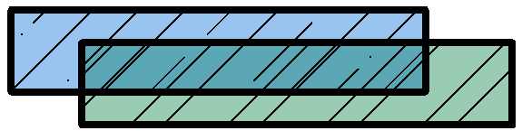
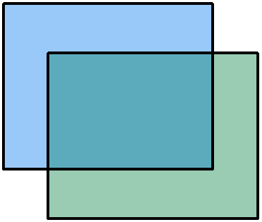
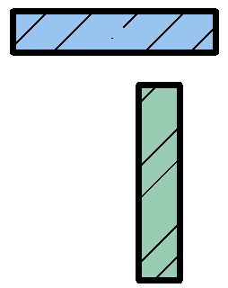
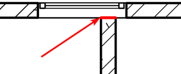
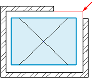
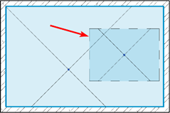
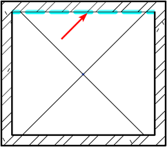

Для более стабильной работы модели Revit необходимо регулярно устранять предупреждения, возникающие в процессе моделирования, поскольку они являются неразрешенными внутренними конфликтами в модели и в последствии могут привести к фатальной ошибке.

:::info 

Необходимо сводить кол-во предупреждений в модели к минимуму, рекомендуемое кол-во предупреждений не должно превышать 400.

:::

Предупреждения Revit можно разделить на 3 группы:

**1\.Условно недопустимые** **предупреждения**, которые можно увидеть только в момент совершения определенного действия и которые не отображаются после в списке диалогового окна "Просмотр предупреждений". Негативно влияющие на модель предупреждения **должны быть исправлены**:



---

*  

   **№**

*  

   **Предупреждение**

*  

   **Негативное**

*  

   **Причина и возможное решение**

---

*  

   1

*  

   Помещение удалено на всех видах модели, но сохранилось в проекте. Помещение можно удалить из всех спецификаций или вернуть в модель с помощью команды "Помещение".

*  

   Да

*  

   Помещение удалено на плане/разрезе, но информация о нем сохраняется в проекте и выводится в спецификацию.

   Такие помещение необходимо удалять из проекта.

---

*  

   2

*  

   Пространство удалено на всех видах модели, но сохранилось в проекте.

   Пространство можно удалить из всех спецификаций или вернуть в модель с помощью команды "Пространство".

*  

   Да

*  

   Помещение удалено на плане/разрезе, но информация о нем сохраняется в проекте и выводится в спецификацию.

   Такие помещение необходимо удалять из проекта.

---

*  

   3

*  

   Верх стены находится ниже, чем подошва стены.

*  

   Да

*  

   При построении/корректировке зависимостей стены, зависимость сверху должна быть выше, чем зависимость снизу, иначе стена будет удалена из модели.

---

*  

   4

*  

   Марка Помещение удалена, но соответствующий элемент "Помещение" еще существует. Можно разместить другую марку для элемента "Помещение" с помощью инструмента марок Помещение или выбрать Помещение и удалить ее.

   

   *Аналогично для категорий зон и пространств.*

*  

   Нет

*  

   С вида удалена только марка помещения, но само помещение сохранено на виде.



**2\.Недопустимые предупреждения** - предупреждения, которые, как правило, говорят об ошибках в процессе проектирования, влияют на расчет в спецификациях, вызывают коллизии и ошибки в расчётах. Их игнорирование, помимо торможения модели, может привести к некорректному получению данных из модели, поэтому **они требуют исправления**. Данные предупреждения отображаются в списке диалогового окна "Просмотр предупреждений":



---

*  

   **№**

*  

   **Предупреждение**

*  

   **Причина**

*  

   **Схема**

*  

   **Последствия**

---

*  

   5

*  

   В одном и том же месте имеются идентичные экземпляры. Это приведет к дублированию позиций в спецификациях.

*  

   Два абсолютно идентичных элемента находятся в одном и том же месте.

*  

   

*  

   Задвоение объемов в спецификациях.

   Коллизия.

---

*  

   6

*  

   Выделенные стены перекрываются. Одна из них может быть проигнорирована при поиске границ помещения. Используйте команду "Разрешить вырезание геометрии" для внедрения одной стены в другую.

*  

   Две стены пересекаются между собой.

*  

   {width=575px height=155px}

*  

   Некорректный подсчет объемов.

   Коллизия.

---

*  

   7

*  

   Выделенные перекрытия пересекаются.

*  

   Два перекрытия пересекаются между собой.

*  

   {width=377px height=319px}

*  

   Некорректный подсчет объемов.

   Коллизия.

---

*  

   8

*  

   Один элемент полностью внутри другого.

*  

   Объем одного тела находится полностью внутри объема другого, а сами тела соединены.

*  

   

*  

   Некорректные подсчет числа и объема элементов.

   Такой элемент невозможно найти вручную в модели (только через предупреждения или спецификацию).

---

*  

   9

*  

   "Экземпляры \<Имя экземпляра> ничего не вырезают."

*  

   Такая ошибка может возникнуть, если дополнительно вырезать полый элемент из основы, который по умолчанию вырезает из нее объем.

*  

   

*  

   Чем больше подобных предупреждений, тем медленнее будет работать модель, поскольку это вырезание вызывает лишнюю взаимосвязь между элементами.

---

*  

   10

*  

   Выделенные элементы объединены, но они не пересекаются.

*  

   Два элемента были соединены инструментом «Соединить», но при этом физически не соприкасаются друг с другом.

*  

   {width=254px height=320px}

*  

   Чем больше подобных «соединений», тем медленнее будет работать модель, поскольку это соединение вызывает лишнюю взаимосвязь между элементами.

---

*  

   11

*  

   Конфликт с примыкающей стеной при вставке.

*  

   В окно или дверь упирается торец стены, перпендикулярный их основе.

*  

   {width=297px height=122px}

*  

   Ошибка в планировочных решениях.

---

*  

   12

*  

   Сетка слегка отклонилась от оси и может вызвать неточности.

*  

   Визуально незаметный поворот элемента (меньше 0,21°).

   При этом при повороте менее 0,0019° Revit позволяет к таким объектам привязывать размерные линии.

*  

   

*  

   Невозможность привязать размер к таким элементам.

   Неточности могут породить другие неточности, т.е. может возникнуть накопительный эффект неточностей в проекте.

---

*  

   13

*  

   Стена слегка отклонилась от оси и может вызвать неточности.

*  

   аналогично п.12

*  

   

*  

   аналогично п.12

---

*  

   14

*  

   Линия в эскизе слегка отклонилась от оси и может вызвать неточности.

*  

   аналогично п.12

*  

   

*  

   аналогично п.12

---

*  

   15

*  

   Потери не определены

*  

   Не задан коэффициент потерь.

*  

   

*  

   Невозможно рассчитать потери.

---

*  

   16

*  

   Элемент (тип …) имеет открытый соединитель (номер соединителя …)

*  

   Конец/начало системы заканчивается открытым участком трубы без оборудования/заглушки и т.п.

   Конец/начало системы заканчивается открытым участком воздуховода без решетки/воздухораспределителя и т.п.

*  

   

*  

   

---

*  

   17

*  

   Конец верхней части лестницы превышает или не достигает верхней отметки лестницы. Добавьте/удалите подступенки в верхней части или измените параметр лестничного марша «Относительная полная высота» в палитре свойств.

*  

   Не верно заданы геометрические характеристики лестницы (либо общая высота лестницы, либо количество ступеней).

   Текущее количество подступенков должно полностью заполнить указанную в свойствах высоту лестницы.

*  

   

*  

   

---

*  

   18

*  

   Помещение - область, которая неправильно окружена.

   

   *Аналогично для категорий зон.*

*  

   Помещение окружено не со всех сторон стенами или разделителями помещений.

*  

   {width=186px height=153px}

*  

   Некорректный подсчет площадей и объемов помещений.

---

*  

   19

*  

   Пространство - область, которая неправильно окружена

*  

   Либо пространство располагается вне помещения, либо в модели АР окружено не со всех сторон стенами или разделителями помещений.

*  

   

*  

   Некорректные спецификации с участием пространств (экспликации помещений, расчетные спецификации).

---

*  

   20

*  

   Несколько элементов "Помещения" в одной и той же окруженной области. Корректные значения площади и периметра будут назначены одному элементу "Помещение", а для других будет отображаться "Избыточная Помещение." Следует разделить области, удалить лишние элементы "Помещения" или перенести их в другие области.

   

   *Аналогично для категорий зон и пространств.*

*  

   В одной области было добавлено два помещения.

*  

   {width=239px height=159px}

*  

   Некорректный подсчет экспликаций помещений.

---

*  

   21

*  

   Стена и линия-разделитель помещений перекрываются. Одна из них может быть проигнорирована при поиске границ помещений. Укоротите или удалите линию-разделитель помещений для устранения перекрытия …

*  

   Добавление разделителя помещения там, где уже расположена стена.

*  

   {width=242px height=214px}

*  

   Лишняя зависимость.

---

*  

   22

*  

   Марка Помещение вне элемента "Помещение". Включите выноску или перенесите марку Помещение внутрь соответствующего элемента "Помещение".

*  

   Марка в процессе перемещения помещения потеряла основу и не считывает значения параметров.

*  

   

*  

   Марка будет каждый раз пытаться найти основу, это вызывает лишнюю взаимосвязь между элементами.



**3\.Допустимые предупреждения** - предупреждения, которые отображаются в списке диалогового окна "Просмотр предупреждений", но являются неустранимыми и, как правило, не приводят к каким-либо ошибкам:



---

*  

   **№**

*  

   **Предупреждение**

*  

   **Причина**

---

*  

   23

*  

   Элементы имеют повторяющиеся значения «…»

*  

   Нескольким элементам назначены одинаковые значения системных параметров «Марка»/«Номер»


